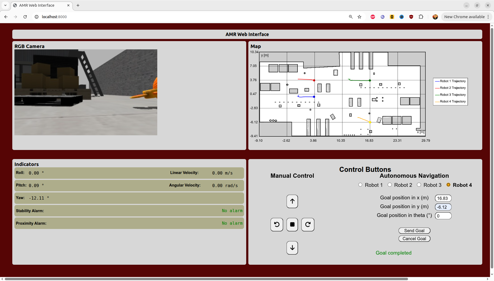
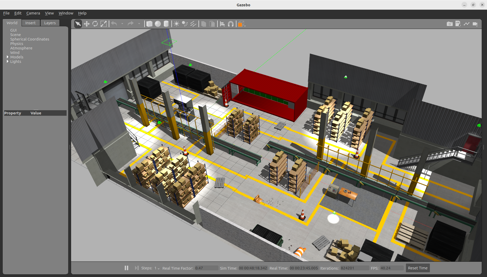

# Sistema de Monitoreo y Control Web de Robots Móviles en Entornos Industriales (Virtual)
## Requisitos previos
* Tener instalado ROS 2 Humble
* Tener instalado los paquetes del robot móvil `TurtleBot 3`
* Tener instalado Gazebo Classic
* Tener instalado los paquetes `Nav2`, `rosbridge_server` y `web_video_server`
## Pasos para inicializar el sistema
### Clonación del repositorio
```bash
git clone https://github.com/lfvargas20/Monitoreo_Control_Web_Multirobot.git
```
### Eliminación de las carpetas build, install y log
```bash
cd ~/Monitoreo_Control_web_Multirobot
```
```bash
rm -rf /build /install /log
```
### Compilación
```bash
colcon build --symlink-install
```
```bash
source install/setup.bash
```
### Comando de activación del proyecto (Terminal 1)
```bash
ros2 launch amr multi_amr_project_launch.launch.py
```
### Comandos para activar el servidor local de la página web de monitoreo y control de los robots (Terminal 2)
```bash
cd ~/Monitoreo_Control_web_Multirobot/web
```

```bash
python3 -m http.server
```
## Dirección local de la página web
[Página web](https://localhost:8000)
## Visualización de la página web

## Visualización del entorno industrial en Gazebo Classic

